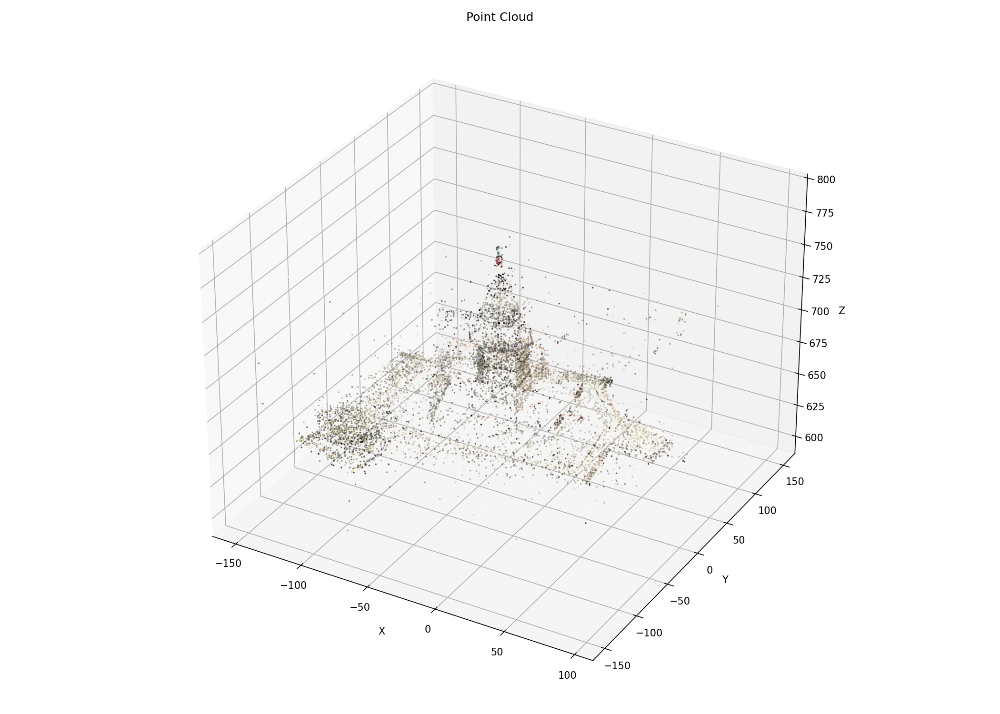

# SLAM 3D Reconstruction

An incremental Structure from Motion (SfM) pipeline that reconstructs a sparse 3D point cloud from a sequence of images, recovering both scene geometry and camera trajectory.

### Kız Kulesi (Maiden's Tower), Istanbul

Photos taken around this medieval Bosphorus tower serve as the example dataset — its freestanding position allows the camera to orbit fully, providing the wide-baseline coverage that SfM needs.




<h3><a href="https://sketchfab.com/models/60328445b7d74ce6aa12ab92feb87c8f/embed?autospin=1&autostart=1&camera=0&ui_hint=0&dnt=1">→ Interactive 3D View on Sketchfab</a></h3>


---

## How It Works

The pipeline processes an ordered sequence of images and builds a 3D point cloud incrementally — each new image extends the existing reconstruction rather than reprocessing everything from scratch.

### 1. Feature Detection & Matching (SIFT + Lowe's Ratio Test)

For each consecutive image pair, keypoints are detected using **SIFT (Scale-Invariant Feature Transform)**, which finds distinctive local features that are stable across changes in scale and rotation. Descriptors are matched using a **Brute-Force KNN Matcher**, and spurious matches are filtered with **Lowe's ratio test** (threshold 0.70): a match is kept only if the nearest neighbor is significantly closer than the second-nearest, ensuring high-quality correspondences.

### 2. Bootstrap: Essential Matrix & Initial Pose Recovery

The reconstruction is seeded from the first image pair. The **Essential Matrix** — which encodes the relative rotation and translation between two calibrated cameras — is estimated from the filtered keypoint matches using RANSAC to reject remaining outliers. The Essential Matrix is then decomposed via `cv2.recoverPose` to extract the relative rotation **R** and translation **t**, with the chirality check ensuring points land in front of both cameras.

The first camera is fixed at the world origin. All subsequent poses are expressed relative to it.

### 3. Triangulation

With two camera projection matrices **P₁ = K·[I|0]** and **P₂ = K·[R|t]** established, corresponding 2D point pairs are lifted into 3D via **linear triangulation** (`cv2.triangulatePoints`). This solves a least-squares system using the constraint that each 2D observation must lie on the ray defined by its camera and the unknown 3D point.

### 4. Incremental Registration via PnP

For each new image added to the reconstruction, the pipeline needs to determine where that camera sits in the world. It does this by:

1. **Data association** — identifying 2D keypoints in the new image that correspond to 3D points already in the point cloud (by tracking which keypoints were shared between the previous image pair).
2. **Perspective-n-Point (PnP)** — given those known 3D↔2D correspondences, `cv2.solvePnPRansac` solves for the new camera's rotation and translation. RANSAC is used again here to handle any mismatches. The rotation vector is converted to a matrix via Rodrigues' formula.

This localise-then-extend loop is what makes the reconstruction incremental: each new camera pose is estimated from existing geometry, then new 3D points are triangulated from the freshly registered camera pair and added to the cloud.

### 5. Reprojection Error

After each triangulation and PnP step, reprojection error is computed as a quality metric — the triangulated 3D points are projected back onto the image plane and compared against the original 2D observations. This gives a normalized per-point error (in pixels) that indicates reconstruction quality.

### 6. Bundle Adjustment (Optional)

When enabled, **bundle adjustment** jointly optimizes camera parameters and 3D point positions to minimize total reprojection error across all observations. This is formulated as a nonlinear least-squares problem and solved using `scipy.optimize.least_squares`. Bundle adjustment produces a more globally consistent reconstruction but is significantly slower.

---

## Pipeline Summary

```
Images → SIFT features → Lowe's filter → Essential Matrix (RANSAC)
       → Initial pose recovery → Triangulation → Seed point cloud
       → For each new image:
             Data association → PnP pose estimation → Triangulate new points
             → Reprojection check → [Bundle Adjustment] → Extend cloud
       → Export PLY point cloud + camera trajectory
```

---

## Usage

Open the notebook in Google Colab and provide:

- **Intrinsic camera matrix K** — focal lengths and principal point for your camera
- **Image directory** — a folder of `.jpg` or `.png` images in sequential order

```python
K = np.array([[fx,  0, cx],
              [ 0, fy, cy],
              [ 0,  0,  1]])

img_dir = '/path/to/your/images'
pose_array = sfm_pipeline(path, img_dir, K, perform_bundle_adjustment=False)
```

The pipeline outputs a colored sparse point cloud (`sparse_ptcloud1.ply`) and the full array of camera projection matrices.

---

## Dependencies

```
opencv-python
numpy
scipy
open3d
plyfile
plotly
matplotlib
tqdm
```
